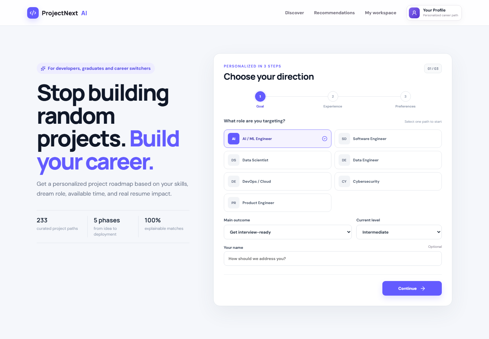

# ProjectNext AI

> An explainable, adaptive project recommendation and execution platform for developers, graduates, and career switchers.

[](backend/requirements.txt)
[](frontend/package.json)
[](backend/app/recommender.py)
[](backend/tests)
[](docker-compose.yml)

ProjectNext AI ranks 233 project paths using Sentence-BERT semantic similarity, strict career-role retrieval, collaborative behavior, resume impact, and realistic time feasibility. Users can teach the recommender with **More like this** and **Not for me**, then turn any recommendation into a milestone-based execution plan.



## Why it is useful

- **Accurate role separation:** Data Scientist and Data Engineer are separate paths; unrelated roles cannot leak into results.
- **Intent-aware ranking:** skills, interests, past projects, exact build vision, domain, required/blocked technologies, goal, timeline, and weekly effort affect ranking.
- **Adaptive preferences:** liked project embeddings move the user vector closer; rejected embeddings move it away before re-ranking.
- **Transparent AI:** every card shows semantic similarity, confidence, known skills, skill gaps, role fit, domain fit, resume impact, and feasibility.
- **Execution workspace:** five milestone phases, architecture, MVP/stretch scope, success metrics, interview questions, resume bullets, and README export.
- **Feedback loop:** saves, starts, dismissals, completions, and ratings become recommendation signals.
- **Production foundations:** async FastAPI, validated schemas, PostgreSQL/SQLite support, Docker, health checks, offline-safe embedding fallback, and automated tests.

## AI transparency

The 233 project records are curated/static catalog entries. **Project ranking is ML-powered** using `sentence-transformers/all-MiniLM-L6-v2`, cosine similarity, Rocchio-style preference adaptation, collaborative signals, and deterministic business constraints. Build blueprints are deterministic, project-aware templates; the product does not falsely label them as LLM-generated.

## 1. High-level architecture

```text
┌──────────────────────── React / Vite ─────────────────────────┐
│ Profile form │ Ranked cards │ Reasons │ Save/complete/rating  │
└───────────────────────────┬────────────────────────────────────┘
                            │ HTTPS / JSON
┌───────────────────────────▼────────────────────────────────────┐
│                         FastAPI                                │
│ /recommend        /projects          /feedback       /health  │
│      │                 │                  │                    │
│      └──────────┬──────┴──────────────────┘                    │
│                 ▼                                               │
│  ┌──────────────── Hybrid ranking service ──────────────────┐  │
│  │ Sentence-BERT cosine similarity (45–60%)                 │  │
│  │ User-user collaborative score (5–25%)                   │  │
│  │ Resume impact / role fit (20–25%) + feasibility (10%)   │  │
│  │ Explanation generator + completed/dismissed filtering    │  │
│  └──────────────┬──────────────────────────────┬─────────────┘  │
└─────────────────┼──────────────────────────────┼────────────────┘
                  │                              │
        ┌─────────▼──────────┐       ┌───────────▼──────────┐
        │ PostgreSQL         │       │ Hugging Face cache   │
        │ users, projects,   │       │ all-MiniLM-L6-v2     │
        │ interactions       │       │ (hash fallback)      │
        └─────────┬──────────┘       └──────────────────────┘
                  │ completion / rating events
                  └──────────────► future offline training,
                                      evaluation and A/B tests
```

At larger scale, precompute project vectors, store them in `pgvector`, put Redis in front of popular queries, send interaction events through Kafka, and retrain collaborative factors in an offline worker. The current design deliberately keeps the first version understandable and demoable while preserving those extension points.

## 2. Database schema

```text
user_profiles
  id UUID-like PK, name VARCHAR(100), skills JSON, interests JSON,
  career_goal VARCHAR(50), target_companies JSON,
  preferred_difficulty ENUM, time_available_weeks INT,
  created_at TIMESTAMPTZ, updated_at TIMESTAMPTZ

projects
  id SERIAL PK, slug UNIQUE, title, description, tech_stack JSON,
  domain INDEX, difficulty INDEX, estimated_weeks,
  resume_value_score FLOAT, target_roles JSON, target_companies JSON,
  learning_outcomes JSON, embedding JSON nullable, created_at

user_project_interactions
  id SERIAL PK, user_id FK INDEX, project_id FK INDEX,
  status ENUM(saved, started, completed, dismissed), rating 1..5 nullable,
  feedback_text, timestamps, UNIQUE(user_id, project_id)
```

The API performs an upsert on the `(user_id, project_id)` interaction, so repeated clicks do not corrupt signals. Production migrations should use Alembic rather than `create_all`; `create_all` is kept here so the submitted app runs with one command.

### PostgreSQL vs MongoDB

| Concern | PostgreSQL | MongoDB |
|---|---|---|
| Users ↔ projects ↔ feedback | Strong foreign keys and unique constraints | References require application-level integrity |
| Analytics/CF matrix export | Joins, aggregates and window functions are excellent | Aggregation pipeline works but is less natural here |
| Flexible project metadata | `JSONB` supports it without losing relational guarantees | Native document model is excellent |
| Vector search | `pgvector` keeps vectors beside trusted data | Atlas Vector Search is strong but managed-service oriented |
| Transactions | Mature and predictable | Supported, with more schema discipline required |
| Best use here | **Recommended primary store** | Good if the catalog changes shape constantly and interactions are separated |

PostgreSQL wins because recommendation feedback is relational and analytics-heavy. Use normalized join tables instead of JSON arrays once skill-level filtering becomes a core query; JSON keeps this MVP compact.

## 3. Recommendation algorithm

```text
INPUT profile, N
projects = fetch all eligible projects
profile_vector = SBERT(profile skills + interests + target role + companies)
project_vectors = SBERT(project semantic documents)
content[p] = cosine(profile_vector, project_vector[p])

interaction_matrix = users × projects using:
  dismissed=-1, saved=1, started=2, completed=3; multiply by rating/3
IF target user has useful history and peer users exist:
  neighbors = cosine(target interactions, every user's interactions)
  collaborative[p] = normalized weighted neighbor preference
ELSE:
  collaborative[p] = Bayesian-smoothed positive popularity

impact[p] = .45*curated_resume_value + .30*role_match
            + .15*skill_bridge + .10*target_company_match
feasibility[p] = .70*time_fit + .30*difficulty_fit

IF cold start:
  final[p] = .60*content + .05*collaborative + .25*impact + .10*feasibility
ELSE:
  final[p] = .45*content + .25*collaborative + .20*impact + .10*feasibility

remove completed and dismissed projects
return top N with component scores and a template-grounded explanation
```

The runnable implementation is in `backend/app/recommender.py`. Transformer inference runs in a worker thread so it cannot block FastAPI's event loop. A hashing-vector fallback keeps the service healthy during a model download/registry incident; `/health` reports the active backend.

## 4. API

- `POST /recommend?limit=10`: validates/upserts a profile and returns ranked, explained results.
- `GET /projects?page=1&page_size=20&domain=NLP&difficulty=advanced&search=search`: catalog pagination and filters.
- `GET /projects/{project_id}/blueprint?user_id=...`: returns the personalized architecture, milestone plan, portfolio kit, and README.
- `POST /feedback`: records `saved`, `started`, `completed`, or `dismissed`; completion requires a 1–5 rating.
- `GET /health`: database/catalog health plus embedding backend.
- Interactive OpenAPI docs: `http://localhost:8000/docs`.

Example request:

```json
{
  "skills": ["Python", "FastAPI", "React", "DistilBERT"],
  "interests": ["recommendation systems", "LLMs", "developer tools"],
  "career_goal": "AI_ML",
  "target_companies": ["Google", "Microsoft", "Amazon"],
  "difficulty": "advanced",
  "time_available_weeks": 12,
  "completed_project_ids": []
}
```

## 5. React UI

`frontend/src/App.jsx` contains the complete profile workflow and recommendation cards. It stores the anonymous user ID in local storage so future visits gain collaborative history. Cards expose component scores, explanations, project metadata, save/start actions, and completion ratings. The responsive visual system is in `frontend/src/index.css`.

## 6. Cold start

For a new user, the system raises content weight to 60%, adds career impact and feasibility, and uses smoothed popularity only as a small tie-breaker. Required onboarding fields provide enough explicit preference data before clicks exist. Good next steps are a five-card preference quiz, diversity re-ranking by domain/stack, contextual bandits for exploration, and cohort priors (role, semester, skill level). For a new project, metadata embeddings make it immediately retrievable without interaction history.

Measure cold start separately with `NDCG@10`, `Recall@10`, save/start conversion, completion rate, and post-completion rating. Avoid optimizing clicks alone; that tends to favor flashy but unfinished projects.

## 7. Monetization

- **Student freemium:** free recommendations; Pro includes weekly roadmaps, architecture reviews, GitHub progress evidence, resume bullets, and interview stories. A reasonable India-first experiment is ₹199–499/month, validated through willingness-to-pay tests.
- **College SaaS:** cohort dashboard, skill-gap analytics, faculty review queues, project originality checks, placement-role alignment, SSO and exports. Charge per active student or annual campus license.
- **Recruiter/partner marketplace:** verified project challenges sponsored by companies. Clearly label sponsored ranking and never mix payment into organic relevance.
- **API/white label:** recommendations embedded in LMS, bootcamp, and placement platforms.

North-star metric: percentage of recommended projects completed with verified evidence. Guardrails: recommendation diversity, completion time, rating, subgroup fairness, and sponsored-result transparency.

## Run locally

### Docker (recommended)

```bash
docker compose up --build
```

Open `http://localhost:5174`; API docs are at `http://localhost:8000/docs`. The first recommendation may take longer while Sentence-BERT downloads and caches.

### Without Docker

```bash
cd backend
python -m venv .venv
# Windows: .venv\Scripts\activate
pip install -r requirements.txt
uvicorn app.main:app --reload
```

In a second terminal:

```bash
cd frontend
npm install
npm run dev
```

SQLite is the zero-config backend default; set `DATABASE_URL` from `.env.example` for PostgreSQL.

## Test and build

```bash
cd backend && pytest -q
cd frontend && npm run build
```

## Render deployment

1. Create managed PostgreSQL and copy its internal connection URL, changing the scheme to `postgresql+asyncpg://`.
2. Deploy `backend/` as a Docker web service; set `DATABASE_URL`, `ALLOWED_ORIGINS`, and `MODEL_NAME`.
3. Deploy `frontend/` as a Docker/static service with build arg `VITE_API_URL=https://<backend-host>`.
4. Give the backend enough RAM for PyTorch/Sentence-BERT (typically at least 1–2 GB), persist the model cache where supported, and set the frontend origin exactly in CORS.

## AWS EC2 deployment

Use an Ubuntu instance with Docker Compose, place Nginx/ALB in front, terminate TLS with ACM, use RDS PostgreSQL rather than a database container, store secrets in SSM/Secrets Manager, restrict security groups, and publish images through ECR. Run at least two backend tasks/instances behind a load balancer for availability. For a serious SaaS, ECS/Fargate is easier to operate than a single mutable EC2 VM.

## FAANG/system-design talking points

- **Retrieval then ranking:** embeddings retrieve relevant candidates; behavioral, career, and feasibility signals rank them. At millions of projects, ANN via pgvector/OpenSearch replaces the all-project scan.
- **Online/offline split:** project embeddings and CF factors are computed offline; the online service only fetches candidates and combines cached features.
- **Feedback quality:** explicit completion/rating is stronger than a click; negative/dismiss signals matter. Event timestamps should receive recency decay.
- **Reliability:** lazy model loading, health reporting, fallback embeddings, validation, database constraints, idempotent feedback, and non-blocking inference.
- **Evaluation:** offline temporal split with NDCG/Recall/diversity, followed by an A/B test measuring starts and verified completions.
- **Trade-offs:** user-user CF is transparent for an MVP; implicit ALS or two-tower retrieval is more scalable. Template explanations are faithful to actual score features, unlike an unconstrained LLM explanation.
- **Responsible ranking:** do not encode company prestige as the only definition of value. Audit exposure across domains, difficulty levels, colleges, and user cohorts.
